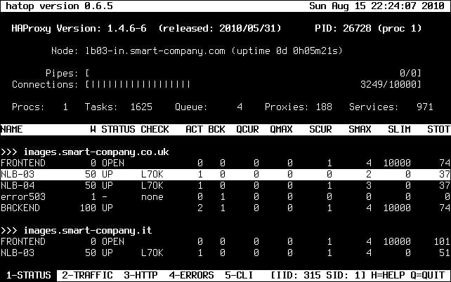
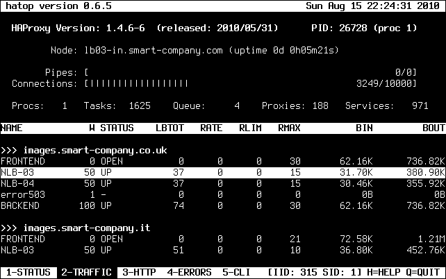
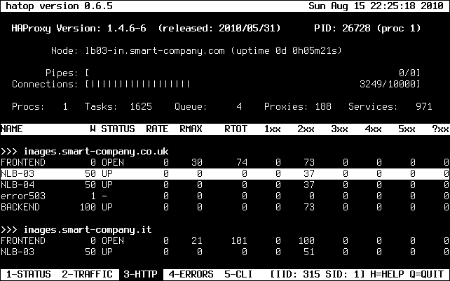
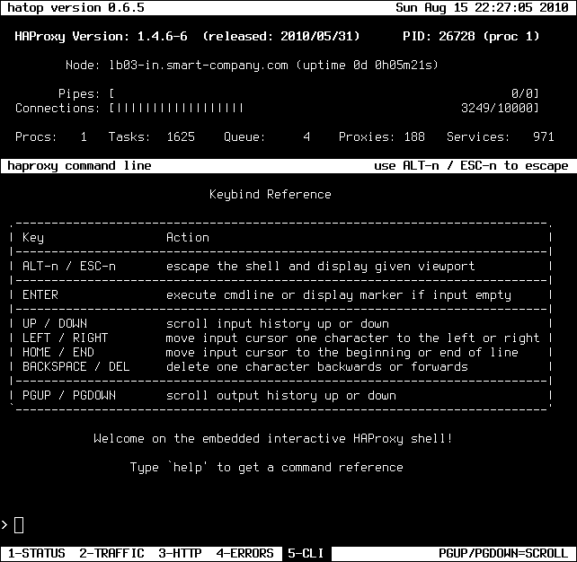
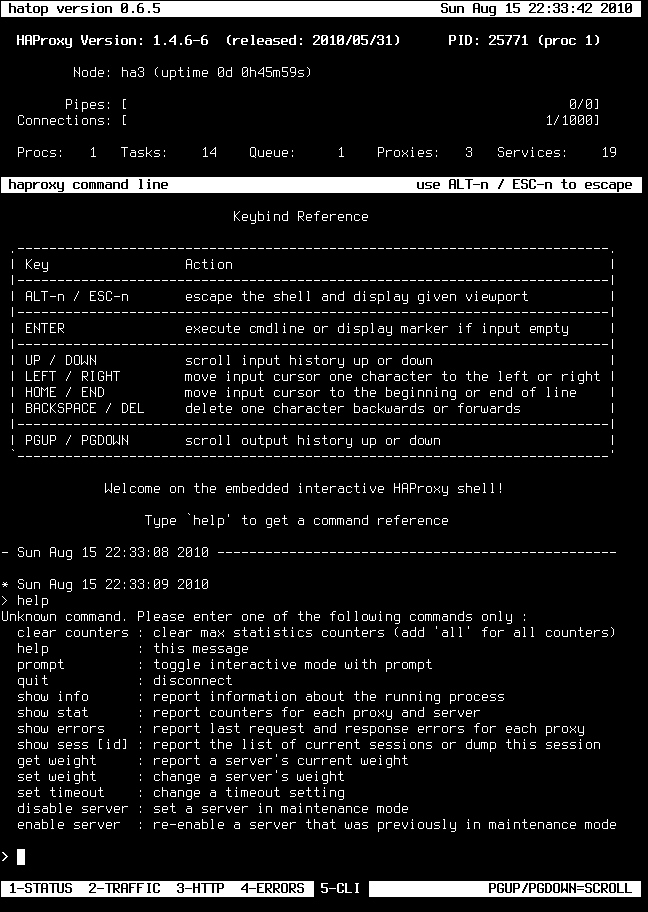

.. _screenshots:

***********
Screenshots
***********

**Short screenshot tour showing all screen modes / viewports in action.**

Global header reference (visible in all modes)::

  Node        configured name of the haproxy node
  Uptime      runtime since haproxy was initially started
  Pipes       pipes are currently used for kernel-based tcp slicing
  Procs       number of haproxy processes
  Tasks       number of actice process tasks
  Queue       number of queued process tasks (run queue)
  Proxies     number of configured proxies
  Services    number of configured services

Online Help
===========

Screenshot:

.. image:: images/0-help.png

1: The default mode with health, session and queue statistics
=============================================================

Screenshot:

Header reference::

  NAME        name of the proxy and his services
  W           configured weight of the service
  STATUS      service status (UP/DOWN/NOLB/MAINT/MAINT(via)...)
  CHECK       status of last health check (see status reference below)

  ACT         server is active (server), number of active servers (backend)
  BCK         server is backup (server), number of backup servers (backend)
  QCUR        current queued requests
  QMAX        max queued requests
  SCUR        current sessions
  SMAX        max sessions
  SLIM        sessions limit
  STOT        total sessions

2: Connection and request rates as well as traffic stats
========================================================

Screenshot:

Header reference::

  NAME        name of the proxy and his services
  W           configured weight of the service
  STATUS      service status (UP/DOWN/NOLB/MAINT/MAINT(via)...)

  LBTOT       total number of times a server was selected
  RATE        number of sessions per second over last elapsed second
  RLIM        limit on new sessions per second
  RMAX        max number of new sessions per second
  BIN         bytes in (IEEE 1541-2002)
  BOUT        bytes out (IEEE 1541-2002)

3: Various statistical information related to HTTP
==================================================

Screenshot:

Header reference::

  NAME        name of the proxy and his services
  W           configured weight of the service
  STATUS      service status (UP/DOWN/NOLB/MAINT/MAINT(via)...)

  RATE        HTTP requests per second over last elapsed second
  RMAX        max number of HTTP requests per second observed
  RTOT        total number of HTTP requests received
  1xx         number of HTTP responses with 1xx code
  2xx         number of HTTP responses with 2xx code
  3xx         number of HTTP responses with 3xx code
  4xx         number of HTTP responses with 4xx code
  5xx         number of HTTP responses with 5xx code
  ?xx         number of HTTP responses with other codes (protocol error)

4: Health info, various error counters and downtimes
====================================================

Screenshot:

.. image:: images/4-errors.png

Header reference::

  NAME        name of the proxy and his services
  W           configured weight of the service
  STATUS      service status (UP/DOWN/NOLB/MAINT/MAINT(via)...)
  CHECK       status of last health check (see status reference below)

  CF          number of failed checks
  CD          number of UP->DOWN transitions
  CL          last status change
  ECONN       connection errors
  EREQ        request errors
  ERSP        response errors
  DREQ        denied requests
  DRSP        denied responses
  DOWN        total downtime

5: The embedded command line client
===================================

Screenshots:

.. raw:: html

    
    

